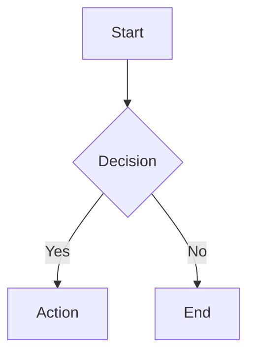

# Slidev Presentations Skill

Generate professional, browser-based presentations using [Slidev](https://sli.dev/) - the presentation framework for developers.

## When to Use This Skill

Activate when the user requests:

- Creating presentation slides
- Technical talks or conference presentations
- Developer-focused slide decks
- Markdown-based presentations with code examples
- Interactive presentations with animations

### Example Trigger Phrases

These prompts should activate this skill:

- "Create a presentation about Kubernetes architecture"
- "Make slides for my talk on TypeScript best practices"
- "Generate a Slidev deck explaining our API design"
- "Build a technical presentation for the team meeting"
- "I need slides for a conference talk on microservices"
- "Create a workshop presentation with code examples"
- "Make a deck covering React hooks for beginners"
- "Generate presentation slides about CI/CD pipelines"

### NOT This Skill

Do NOT activate for:

- PowerPoint or Google Slides requests (different format)
- Simple document or README generation
- Non-presentation Markdown files
- Requests for presentation tips without actual slide creation

## Example Outputs

See the `assets/` directory for complete example presentations:

- `example-technical-talk.md` - Conference-style deep dive (Kubernetes)
- `example-tutorial.md` - Workshop format with exercises (TypeScript)
- `example-team-update.md` - Internal team presentation (Q4 update)

## Reference Documentation

See the `references/` directory for syntax details:

- `slidev-quick-reference.md` - Complete syntax cheatsheet
- `layouts-guide.md` - All layouts with usage guidance
- `themes.md` - Theme options and customization

## Quick Setup

If the user doesn't have Slidev installed, provide these commands:

```bash
# Create new presentation (recommended)
npm init slidev@latest

# Or with pnpm
pnpm create slidev

# Or add to existing project
npm install @slidev/cli @slidev/theme-default
```

Run the presentation:

```bash
# Development mode with hot reload
npx slidev

# Build for production
npx slidev build

# Export to PDF (requires playwright-chromium)
npx slidev export

# Export to PPTX
npx slidev export --format pptx
```

## Output Format

Generate a complete `slides.md` file that can be run directly with Slidev.

## Core Syntax (Quick Reference)

For full syntax details, see `references/slidev-quick-reference.md`.

### Basic Structure

```markdown
---
theme: default
title: My Presentation
transition: slide-left
mdc: true
---

# First Slide

Content here

---

# Second Slide

More content
```

### Key Layouts

| Layout            | Use Case                  |
| ----------------- | ------------------------- |
| `cover`           | Title slide               |
| `center`          | Centered content          |
| `section`         | Section divider           |
| `two-cols`        | Side-by-side content      |
| `two-cols-header` | Header + two columns      |
| `image-right`     | Image right, content left |
| `fact`            | Highlight a statistic     |

### Two-Column Layout

```markdown
---
layout: two-cols-header
---

# Header

::left::

Left content

::right::

Right content
```

### Code with Line Highlighting

````markdown
```typescript {2,3}
function add(a: number, b: number) {
  const sum = a + b  // highlighted
  return sum         // highlighted
}
```
````

### Click-to-Reveal Code

````markdown
```typescript {1|2|3|all}
const a = 1  // click 1
const b = 2  // click 2
const c = 3  // click 3
```
````

### Animations

```html
<!-- Reveal items one-by-one -->
<v-clicks>

- First item (click 1)
- Second item (click 2)

</v-clicks>

<!-- Single element reveal -->
<div v-click>Appears on click</div>
```

### Presenter Notes

```markdown
# Slide Title

Content

<!--
Speaker notes here (presenter mode only)
-->
```

### Diagrams (Mermaid)

````markdown

````

## Advanced Features

See reference files for complete documentation:

- **Shiki Magic Move** - Animated code transitions between states
- **Monaco Editor** - Interactive, editable code blocks
- **Vue Components** - Custom components in `components/` directory
- **UnoCSS** - Utility-first CSS classes (built-in)
- **Multi-file splitting** - `src: ./pages/section.md` to import slides
- **LaTeX Math** - `$E = mc^2$` inline, `$$...$$` for blocks
- **MDC Syntax** - `[styled text]{style="color:red"}` (requires `mdc: true`)
