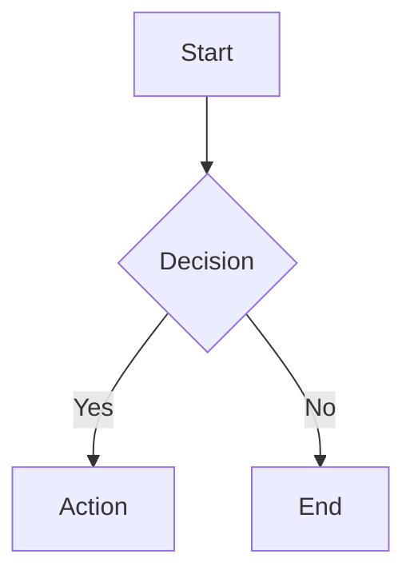

# Slidev Presentations Skill

Generate professional, browser-based presentations using [Slidev](https://sli.dev/) - the presentation framework for developers.

## When to Use This Skill

Activate when the user requests:

- Creating presentation slides
- Technical talks or conference presentations
- Developer-focused slide decks
- Markdown-based presentations with code examples
- Interactive presentations with animations

### Example Trigger Phrases

These prompts should activate this skill:

- "Create a presentation about Kubernetes architecture"
- "Make slides for my talk on TypeScript best practices"
- "Generate a Slidev deck explaining our API design"
- "Build a technical presentation for the team meeting"
- "I need slides for a conference talk on microservices"
- "Create a workshop presentation with code examples"
- "Make a deck covering React hooks for beginners"
- "Generate presentation slides about CI/CD pipelines"

### NOT This Skill

Do NOT activate for:

- PowerPoint or Google Slides requests (different format)
- Simple document or README generation
- Non-presentation Markdown files
- Requests for presentation tips without actual slide creation

## Recommended Workflow

Follow the **plan-first approach** for quality presentations:

```text
1. Gather Context  →  2. Create Plan  →  3. Review Plan  →  4. Generate Slides
```

### Why Plan First?

- Plans capture audience, duration, and core message
- Review checkpoint before investing in slide generation
- Plans become presenter notes and Q&A preparation
- Easier to iterate on structure than on finished slides

### Workflow Options

| Scenario                      | Command                                         | Output        |
| ----------------------------- | ----------------------------------------------- | ------------- |
| New presentation on a topic   | `/slidev:plan [topic]` then `/slidev:from-plan` | Plan + Slides |
| Presentation about a codebase | `/slidev:from-codebase [path]`                  | Plan + Slides |
| Quick slides (skip planning)  | `/slidev:new [topic]`                           | Slides only   |
| Generate from existing plan   | `/slidev:from-plan [plan-file]`                 | Slides only   |

### Plan Document Structure

A presentation plan includes:

- **Metadata**: Duration, audience, format, venue
- **Core Message**: The ONE thing to remember
- **Time Allocation**: Section breakdown with minutes
- **Section Details**: Key points, visuals needed, talking points
- **Diagrams to Create**: Architecture, flow, comparisons
- **Code Examples**: Files, lines, what to highlight
- **Demo Plan**: What to show, commands, backup plan
- **Q&A Preparation**: Anticipated questions and answers
- **Presenter Checklist**: Before/during presentation tasks

### Questions to Gather

When creating a plan, gather:

1. **Duration**: Lightning (5-10 min) to deep dive (45-60 min)
2. **Audience**: Peers, leadership, external, onboarding
3. **Format**: Lecture, demo-heavy, workshop, Q&A-heavy
4. **Venue**: Team meeting, conference, client presentation
5. **Focus Areas**: Architecture, features, API, testing, DevOps
6. **Technical Depth**: High-level, moderate, deep dive
7. **Core Message**: What's the ONE thing to remember?
8. **Call to Action**: What should audience DO after?

## Example Outputs

See the `assets/` directory for complete example presentations:

- `example-technical-talk.md` - Conference-style deep dive (Kubernetes)
- `example-tutorial.md` - Workshop format with exercises (TypeScript)
- `example-team-update.md` - Internal team presentation (Q4 update)

## Reference Documentation

See the `references/` directory for syntax details:

- `slidev-quick-reference.md` - Complete syntax cheatsheet
- `layouts-guide.md` - All layouts with usage guidance
- `themes.md` - Theme options and customization

## Quick Setup

If the user doesn't have Slidev installed, provide these commands:

```bash
# Create new presentation (recommended)
npm init slidev@latest

# Or with pnpm
pnpm create slidev

# Or add to existing project
npm install @slidev/cli @slidev/theme-default
```

Run the presentation:

```bash
# Development mode with hot reload
npx slidev

# Build for production
npx slidev build

# Export to PDF (requires playwright-chromium)
npx slidev export

# Export to PPTX
npx slidev export --format pptx
```

## Output Format

Generate a complete `slides.md` file that can be run directly with Slidev.

## Core Syntax (Quick Reference)

For full syntax details, see `references/slidev-quick-reference.md`.

### Basic Structure

```markdown
---
theme: default
title: My Presentation
transition: slide-left
mdc: true
---

# First Slide

Content here

---

# Second Slide

More content
```

### Key Layouts

| Layout            | Use Case                  |
| ----------------- | ------------------------- |
| `cover`           | Title slide               |
| `center`          | Centered content          |
| `section`         | Section divider           |
| `two-cols`        | Side-by-side content      |
| `two-cols-header` | Header + two columns      |
| `image-right`     | Image right, content left |
| `fact`            | Highlight a statistic     |

### Two-Column Layout

```markdown
---
layout: two-cols-header
---

# Header

::left::

Left content

::right::

Right content
```

### Code with Line Highlighting

````markdown
```typescript {2,3}
function add(a: number, b: number) {
  const sum = a + b  // highlighted
  return sum         // highlighted
}
```
````

### Click-to-Reveal Code

````markdown
```typescript {1|2|3|all}
const a = 1  // click 1
const b = 2  // click 2
const c = 3  // click 3
```
````

### Animations

```html
<!-- Reveal items one-by-one -->
<v-clicks>

- First item (click 1)
- Second item (click 2)

</v-clicks>

<!-- Single element reveal -->
<div v-click>Appears on click</div>
```

### Presenter Notes

```markdown
# Slide Title

Content

<!--
Speaker notes here (presenter mode only)
-->
```

### Diagrams (Mermaid)

````markdown

````

## Advanced Features

See `references/slidev-quick-reference.md` for complete documentation.

### Core Features

- **Shiki Magic Move** - Animated code transitions between states
- **Monaco Editor** - Interactive, editable code blocks
- **Vue Components** - Custom components in `components/` directory
- **UnoCSS** - Utility-first CSS classes (built-in)
- **Multi-file splitting** - `src: ./pages/section.md` to import slides
- **LaTeX Math** - `$E = mc^2$` inline, `$$...$$` for blocks
- **MDC Syntax** - `[styled text]{style="color:red"}` (requires `mdc: true`)

### Advanced Animations

**v-motion** - Movement animations with @vueuse/motion:

```html
<div v-motion
  :initial="{ x: -80, opacity: 0 }"
  :enter="{ x: 0, opacity: 1 }"
  :click-1="{ scale: 1.2 }"
>
  Animates on enter and click
</div>
```

**Click Ranges** - Control visibility windows:

```html
<div v-click="[2, 5]">Visible at clicks 2-4</div>
```

**Relative Positioning** - Position clicks relative to previous:

```html
<div v-click="'+2'">Two clicks after previous</div>
```

### Themes

Official themes: `default`, `seriph`, `apple-basic`, `shibainu`, `bricks`

```yaml
---
theme: seriph
---
```

Browse: <https://sli.dev/resources/theme-gallery>

### Addons

Extend Slidev with addons for Python execution, QR codes, diagrams, and more:

```yaml
---
addons:
  - slidev-addon-python-runner
  - slidev-addon-qrcode
---
```

Popular addons: `python-runner`, `rabbit`, `excalidraw`, `qrcode`, `asciinema`

Browse: <https://sli.dev/resources/addon-gallery>

### v-mark Rough Annotations

Add hand-drawn style emphasis to any element using RoughNotation:

```html
<span v-mark.underline>Important concept</span>
<span v-mark.circle>Key term</span>
<span v-mark.highlight="{ color: 'yellow' }">Highlighted</span>
<span v-mark.box>Boxed content</span>
<span v-mark.strike>Crossed out</span>
```

Click-triggered marks (appears on specific click):

```html
<span v-mark.underline="3">Appears on click 3</span>
```

Types: `underline`, `circle`, `highlight`, `box`, `bracket`, `strike-through`

### Runnable Monaco Editor

Live code execution in slides - perfect for workshops and demos:

````markdown
```typescript {monaco-run}
// Audience can edit AND execute this code
const result = [1, 2, 3].map(x => x * 2)
console.log(result) // Output appears below!
```
````

Use `{monaco-run}` instead of `{monaco}` to enable execution with output display.

### Live Drawing & Annotations

Built-in drawing tools (powered by drauu) for live annotation during presentations:

- Press `d` to toggle drawing mode
- Annotations persist across slide navigation
- Configure in frontmatter:

```yaml
---
drawings:
  enabled: true
  persist: true
  presenterOnly: false
---
```

### Click-Synced Presenter Notes

Sync presenter notes to your click animations using `[click]` markers:

```markdown
# Slide Title

<v-clicks>

- Point A
- Point B
- Point C

</v-clicks>

<!--
[click] Explain point A in detail
[click] Now discuss point B
[click] Finally cover point C
-->
```

The presenter view shows only the relevant note section as you progress through clicks.

### Icons (UnoCSS Icons)

Access 100k+ icons from Iconify using UnoCSS class syntax:

```html
<div class="i-carbon-logo-github text-4xl" />
<div class="i-mdi-heart text-red-500 text-3xl" />
<div class="i-heroicons-check-circle text-green-500" />
```

Format: `i-{collection}-{icon-name}`

Browse icons: <https://icones.js.org/>
