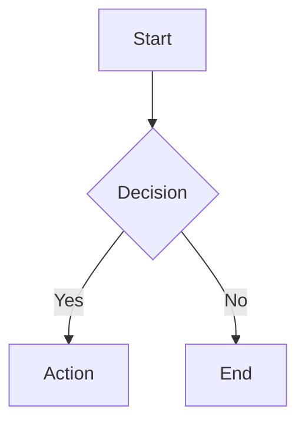
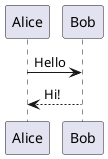

# Slidev Quick Reference

## Project Setup

```bash
# Create new project
npm init slidev@latest

# Or in existing project
npm install @slidev/cli @slidev/theme-default

# Start dev server
npx slidev

# Build for production
npx slidev build

# Export to PDF
npx slidev export
```

## File Structure

```text
project/
├── slides.md          # Main presentation
├── package.json
├── components/        # Custom Vue components
├── pages/             # Additional slide files
├── public/            # Static assets
└── styles/            # Custom CSS
```

## Frontmatter (Global Config)

Place at the very start of `slides.md`:

```yaml
---
theme: default
title: Presentation Title
info: |
  ## Description
  Multi-line info shown in presenter mode
author: Your Name
keywords: keyword1,keyword2
highlighter: shiki
lineNumbers: true
transition: slide-left
mdc: true
download: true
exportFilename: my-presentation
drawings:
  persist: false
class: text-center
---
```

## Slide Separator

Slides are separated by `---` on its own line:

```markdown
# Slide 1

Content

---

# Slide 2

More content
```

## Slide-Level Frontmatter

```yaml
---
layout: center
background: /image.jpg
class: my-custom-class
transition: fade
clicks: 3
---
```

## Layouts Reference

| Layout            | Use Case                  |
| ----------------- | ------------------------- |
| `default`         | Standard content slide    |
| `center`          | Centered content          |
| `cover`           | Title/opening slide       |
| `intro`           | Introduction slide        |
| `section`         | Section divider           |
| `statement`       | Bold statement            |
| `fact`            | Highlight a statistic     |
| `quote`           | Quotation                 |
| `image`           | Full-bleed image          |
| `image-left`      | Image left, content right |
| `image-right`     | Image right, content left |
| `two-cols`        | Two columns               |
| `two-cols-header` | Header + two columns      |
| `iframe`          | Embed webpage             |
| `end`             | Closing slide             |
| `none`            | No default styling        |

## Two-Column Layouts

```markdown
---
layout: two-cols
---

# Left Side

Content here

::right::

# Right Side

Content here
```

```markdown
---
layout: two-cols-header
---

# Spanning Header

::left::

Left content

::right::

Right content
```

## Code Blocks

### Basic

````markdown
```typescript
const x = 1
```
````

### Line Highlighting

````markdown
```typescript {2,3}
const a = 1
const b = 2  // highlighted
const c = 3  // highlighted
```
````

### Click-to-Reveal Lines

````markdown
```typescript {1|2|3|all}
const a = 1  // click 1
const b = 2  // click 2
const c = 3  // click 3
```
````

### Line Numbers

````markdown
```typescript {lines:true}
// Shows line numbers
```

```typescript {2,3}{lines:true,startLine:5}
// Line numbers start at 5
```
````

### Scrollable Code

````markdown
```typescript {*}{maxHeight:'200px'}
// Long code block becomes scrollable
```
````

### Monaco Editor (Interactive)

````markdown
```typescript {monaco}
// Live editable code
```
````

## Animations

### v-click (Reveal on Click)

```html
<v-click>
This appears after one click
</v-click>

<div v-click>Also works on elements</div>

<div v-click="3">Appears on click 3</div>
```

### v-clicks (Auto-wrap List Items)

```html
<v-clicks>

- First (click 1)
- Second (click 2)
- Third (click 3)

</v-clicks>
```

### v-after (Same Time as Previous)

```html
<div v-click>Appears first</div>
<div v-after>Appears simultaneously</div>
```

### Hide on Click

```html
<div v-click.hide="3">Hidden after 3 clicks</div>
```

## Presenter Notes

```markdown
# Slide Title

Visible content

<!--
Speaker notes here (only in presenter mode)
- Bullet points work
- **Markdown** supported
-->
```

## Transitions

Global (in frontmatter):

```yaml
transition: slide-left
```

Per-slide:

```yaml
---
transition: fade
---
```

Options: `slide-left`, `slide-right`, `slide-up`, `slide-down`, `fade`, `fade-out`, `none`

## Diagrams

### Mermaid

````markdown

````

### PlantUML

````markdown

````

## Math (LaTeX)

Inline: `$E = mc^2$`

Block:

```markdown
$$
\int_0^\infty e^{-x^2} dx = \frac{\sqrt{\pi}}{2}
$$
```

## Images

```markdown
<!-- In frontmatter for background -->
---
background: /path/to/image.jpg
---

<!-- Inline -->


<!-- With MDC sizing (requires mdc: true) -->
{width=400px}
```

## MDC Syntax

Enable in frontmatter: `mdc: true`

```markdown
<!-- Styled text -->
This is [red text]{style="color:red"}

<!-- Image with attributes -->
{width=500px}

<!-- Block component -->
::block-component{prop="value"}
Content
::
```

## Global Styles

Add at end of any slide:

```html
<style>
h1 {
  color: #2B90B6;
}
.slidev-layout {
  background: #f5f5f5;
}
</style>
```

## Importing External Slides

```markdown
---
src: ./pages/intro.md
---

---

# Regular Slide

---
src: ./pages/outro.md
---
```

## Shiki Magic Move (Animated Code Transitions)

Animate between code states with smooth transitions:

`````markdown
````md magic-move
```js
// Step 1: Initial state
const count = 1
```

```js
// Step 2: Added line
const count = 1
const doubled = count * 2
```

```js
// Step 3: Refactored
function double(n) {
  return n * 2
}
const result = double(1)
```
````
`````

Each code block becomes a step. Slidev animates the differences between steps on click.

## Vue Components

Create custom components in `components/` directory:

```text
project/
├── slides.md
└── components/
    └── Counter.vue
```

```vue
<!-- components/Counter.vue -->
<script setup>
import { ref } from 'vue'
const count = ref(0)
</script>

<template>
  <button @click="count++">Count: {{ count }}</button>
</template>
```

Use directly in slides:

```markdown
# Interactive Demo

<Counter />
```

## UnoCSS (Built-in Utility Classes)

UnoCSS is pre-configured. Use Tailwind-like utilities directly:

```markdown
# Styled Content

<div class="text-3xl font-bold text-blue-500 p-4 rounded-lg bg-gray-100">
  Styled with utilities
</div>

<div class="flex gap-4 items-center justify-between">
  <span class="text-red-500">Left</span>
  <span class="text-green-500">Right</span>
</div>
```

Common utilities:

- **Text**: `text-sm`, `text-xl`, `text-3xl`, `font-bold`, `text-center`
- **Colors**: `text-blue-500`, `bg-gray-100`, `border-red-300`
- **Spacing**: `p-4`, `m-2`, `px-6`, `py-3`, `gap-4`
- **Flexbox**: `flex`, `items-center`, `justify-between`, `flex-col`
- **Grid**: `grid`, `grid-cols-2`, `grid-cols-3`

## Scoped Styles

Style a specific slide only:

```markdown
# My Slide

Content here

<style scoped>
h1 {
  color: #e11d48;
  font-size: 3rem;
}
</style>
```

## CLI Commands

```bash
# Development
npx slidev                    # Start dev server
npx slidev --port 8080        # Custom port
npx slidev --open             # Auto-open browser

# Build
npx slidev build              # Build SPA
npx slidev build --base /sub/ # Custom base path

# Export
npx slidev export             # Export to PDF
npx slidev export --dark      # Dark mode export
npx slidev export --with-clicks  # Separate page per click
npx slidev export --format png   # Export as images
npx slidev export --format pptx  # Export to PowerPoint
```

## Keyboard Shortcuts (Presentation Mode)

| Key                 | Action                   |
| ------------------- | ------------------------ |
| `Space` / `→` / `↓` | Next animation/slide     |
| `←` / `↑`           | Previous                 |
| `f`                 | Toggle fullscreen        |
| `o`                 | Toggle overview          |
| `d`                 | Toggle dark mode         |
| `g`                 | Go to slide              |
| `Esc`               | Exit fullscreen/overview |
